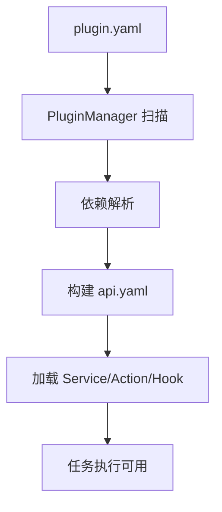
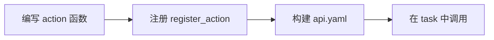
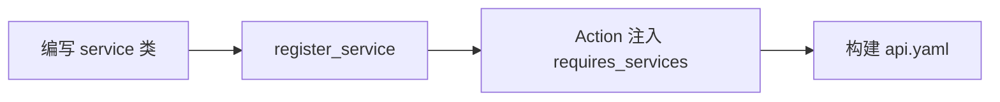

---
# 插件开发指南（Action / Service / Hook）

Aura 的可扩展能力来自插件体系。插件分为两类：
- **Plan 插件**（`plans/`）: 任务编排与业务逻辑
- **功能插件**（`packages/`）: 通用 Action / Service

## 插件加载流程图


## 1. plugin.yaml 结构
`plugin.yaml` 是插件的入口描述文件，用于识别插件身份、依赖与扩展关系。
```yaml
identity:
  author: "YourName"
  name: "demo"
  version: "0.1.0"
description: "Demo plugin"
homepage: ""
dependencies:
  "Aura-Project/base": ">=1.0.0"
extends: []
overrides: []
```

- `dependencies` 是 Aura 插件依赖（不是 pip 依赖）
- pip 依赖请放在 `requirements.txt`

### 1.1 推荐目录结构
将任务、Action、Service 分目录组织，可以减少耦合并提高可维护性。
```text
plans/HelloWorld/
  plugin.yaml
  tasks/
  actions/
  services/
  hooks.py
  requirements.txt
```

## 2. 编写 Action
Action 是任务节点的执行单元，负责执行具体逻辑并返回结果。
```python
# plans/HelloWorld/actions/hello_actions.py
from packages.aura_core.api import register_action

@register_action(name="hello.greet", public=True)
def greet(name: str) -> str:
    return f"Hello, {name}!"
```

在任务中使用：
```yaml
steps:
  greet:
    action: hello.greet
    params:
      name: "{{ inputs.name }}"
```

Action 开发流程：


## 3. 编写 Service
Service 用于提供可复用的业务能力，例如连接池、客户端封装或缓存。
```python
from packages.aura_core.api import register_service

@register_service(alias="greeter", public=True)
class GreeterService:
    def format(self, name: str) -> str:
        return f"Hello, {name}!"
```

注入 Service：
```python
from packages.aura_core.api import register_action, requires_services

@register_action(name="hello.greet", public=True)
@requires_services(greeter="greeter")
def greet(name: str, greeter) -> str:
    return greeter.format(name)
```

Service 开发流程：


## 4. Hook 扩展
Hook 用于在任务执行的关键阶段插入扩展逻辑，例如埋点或审计。
在插件根目录放置 `hooks.py`：
```python
from packages.aura_core.api import register_hook

@register_hook("after_task_success")
async def on_task_success(task_context):
    ...
```

常见 hook 名称：
- `before_task_run`
- `after_task_success`
- `after_task_failure`
- `after_task_run`

## 5. 依赖与构建
- Plan 的 Python 依赖放在 `plans/<plan>/requirements.txt`
- `PluginManager` 会在 `api.yaml` 缺失时自动构建
- 手动构建：
  ```bash
  python cli.py package build <package_path>
  ```

构建后需重启后端/控制台，使新增的 Action/Service 生效。

## 6. 服务扩展与覆盖
```yaml
extends:
  - service: "logger"
    from: "Aura-Project/base"
overrides:
  - "Aura-Project/base/logger"
```

扩展服务会通过 `InheritanceProxy` 组合父子实例。
