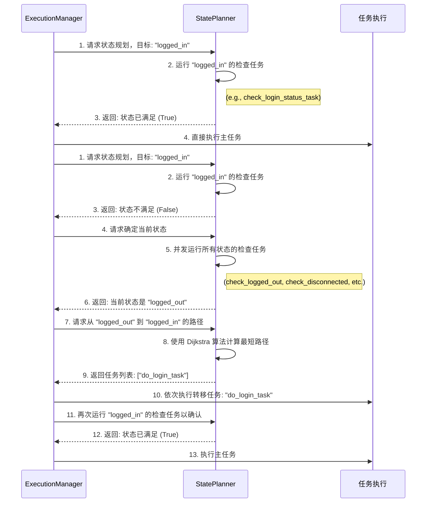

---

# **Aura 声明式状态管理 (`states_map.yaml`) 指南**

欢迎来到 Aura 最强大的功能之一：声明式状态管理。这个系统允许您不再关心“如何做”，而只需关心“我要什么”。您可以简单地告诉 Aura：“我需要系统处于‘已登录’状态”，Aura 的**状态规划器 (StatePlanner)** 就会像 GPS 一样，自动计算并执行一系列任务，将系统从当前状态导航到您期望的目标状态。

本指南将深入讲解其工作原理、如何编写 `states_map.yaml` 文件，以及如何利用它来构建极其健壮和智能的自动化工作流。

## 章节 1: 核心理念 - “状态”而非“步骤”

在传统的自动化中，您需要编写线性的脚本来处理各种情况：
*   “先检查是否登录，如果没登录，就执行登录任务，如果登录了，就跳过...”
*   “先检查是否在主城，如果不在，就执行回城任务...”

这种命令式的逻辑很快会变得复杂且难以维护。

Aura 的状态管理系统颠覆了这一点。您只需：
1.  **定义系统可能存在的各种“状态”**（例如 `logged_in`, `at_home_screen`, `in_combat`）。
2.  **为每个状态提供一个“检查任务”**，这个任务能返回 `true` 或 `false`，以判断系统当前是否处于该状态。
3.  **定义状态之间的“转移路径”**，即可以从一个状态转移到另一个状态的“过渡任务”。
4.  在您的主任务中，**声明它需要的前置状态**（例如 `required_initial_state: "logged_in"`）。

当您运行这个主任务时，Aura 会在后台自动完成所有检查和导航，确保在执行您的主任务逻辑之前，系统已经处于您所期望的状态。

## 章节 2: 工作原理

当 `ExecutionManager` 准备执行一个声明了 `required_initial_state` 的任务时，会触发以下流程：



这个自动化、自修复的流程是 Aura 健壮性的核心。

## 章节 3: 编写 `states_map.yaml`

要在您的方案中启用状态规划，您需要在方案的根目录下创建一个 `states_map.yaml` 文件。这个文件包含两大部分：`states` 和 `transitions`。

```yaml
# my_plan/states_map.yaml

# 1. 定义所有可能的状态
states:
  # 状态的唯一名称
  logged_out:
    description: "游戏已启动，但未登录账号。"
    # 一个返回布尔值的任务，用于检查当前是否处于此状态
    check_task: "MyPlan/common/check_logged_out"

  logged_in:
    description: "已成功登录，位于角色选择界面。"
    check_task: "MyPlan/common/check_logged_in"

  in_game_at_home:
    description: "已进入游戏，角色位于主城安全区。"
    check_task: "MyPlan/common/check_in_game_at_home"

# 2. 定义状态之间的转移路径
transitions:
  # 从 logged_out 到 logged_in
  - from: "logged_out"
    to: "logged_in"
    # 执行此转移需要运行的任务
    transition_task: "MyPlan/common/do_login"
    # （可选）执行此转移的成本，默认为 1
    cost: 1

  # 从 logged_in 到 in_game_at_home
  - from: "logged_in"
    to: "in_game_at_home"
    transition_task: "MyPlan/common/select_character_and_enter_game"
    cost: 5 # 进入游戏可能比登录更耗时，成本更高

  # 一个捷径，但成本很高
  - from: "logged_out"
    to: "in_game_at_home"
    transition_task: "MyPlan/common/one_click_login_and_enter"
    cost: 10
```

### `states` 块详解

这是一个字典，键是状态的唯一名称。每个状态定义包含：
*   `description` (字符串, 可选): 对这个状态的人类可读描述。
*   `check_task` (字符串, **必需**): 一个任务的完整 ID。这个任务**必须**能明确地返回一个布尔值 (`true` 或 `false`)。`true` 表示系统当前处于此状态。

**`check_task` 的实现要点**:
*   **必须明确返回**: 您的检查任务应该在 `returns` 块中明确返回一个布尔值。例如：
    ```yaml
    # tasks/common.yaml
    check_logged_in:
      returns: "{{ '角色选择' in app.get_screen_text() }}"
      steps:
        check_screen:
          action: log.info # 甚至可以只是一个空操作，关键在 returns
    ```
*   **必须互斥**: 在任何给定时间，理想情况下只有一个状态的 `check_task` 应该返回 `true`。如果多个检查任务同时返回 `true`，规划器会选择它找到的第一个，这可能导致不确定的行为。

### `transitions` 块详解

这是一个列表，每一项都是一个描述状态转移路径的字典。
*   `from` (字符串, **必需**): 起始状态的名称。
*   `to` (字符串, **必需**): 目标状态的名称。
*   `transition_task` (字符串, **必需**): 要执行的转移任务的完整 ID。
*   `cost` (数字, 可选, 默认为 `1`): 执行此转移的成本。`StatePlanner` 使用 Dijkstra 算法，总是会选择总成本最低的路径。您可以根据任务的耗时、资源消耗或失败风险来设置成本。例如，一个耗时长的任务可以设置更高的 `cost`。

## 章节 4: 在任务中应用状态规划

一旦您定义了 `states_map.yaml`，在任务中使用它就非常简单了。只需在任务的顶层添加 `required_initial_state` 关键字。

```yaml
# tasks/quests.yaml

do_daily_quests:
  # 声明：在运行此任务前，系统必须处于 'in_game_at_home' 状态
  required_initial_state: "in_game_at_home"

  steps:
    open_quest_panel:
      name: "打开任务面板"
      action: app.click
      params: { text: "每日任务" }
    # ... 后续任务步骤 ...
```

当您运行 `aura run MyPlan/quests/do_daily_quests` 时：
*   如果 Aura 检查后发现系统已经处于 `in_game_at_home` 状态，它会直接开始执行 `open_quest_panel` 步骤。
*   如果 Aura 检查后发现系统处于 `logged_out` 状态，它会自动计算出路径 `logged_out -> logged_in -> in_game_at_home`，然后依次执行 `do_login` 和 `select_character_and_enter_game` 任务。在确认系统已达到 `in_game_at_home` 状态后，才会开始执行 `open_quest_panel`。

## 章节 5: 最佳实践

1.  **原子化的检查任务**: 保持您的 `check_task` 快速、轻量且高度可靠。它们被调用的频率可能很高。
2.  **健壮的转移任务**: 您的 `transition_task` 应该尽可能健壮。如果一个转移任务失败，整个状态规划过程就会失败。为它们添加适当的 `retry` 和错误处理。
3.  **合理的成本设置**: 使用 `cost` 来影响路径选择。如果有多条路径可以到达同一个状态，为更快速、更可靠的路径设置更低的成本。
4.  **定义“死胡同”状态**: 如果系统可能进入一个无法恢复的错误状态（例如，被服务器踢下线且无法重连），也为它定义一个状态，但不要为它定义任何 `from` 此状态的转移路径。这样，如果规划器发现当前处于这个状态，它会直接报告规划失败，而不是尝试无效的操作。
5.  **从简单开始**: 先定义几个关键的核心状态（如 `logged_out`, `logged_in`, `in_game`），然后再根据需要逐步增加更细粒度的状态（如 `in_combat`, `in_shop`）。

通过掌握声明式状态管理，您将从编写脆弱的线性脚本，转变为构建能够自我诊断、自我导航、自我修复的智能自动化系统。这是提升您 Aura 方案健壮性和智能性的关键一步。

