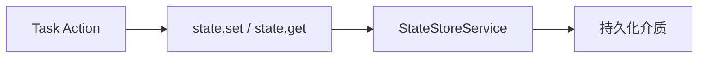
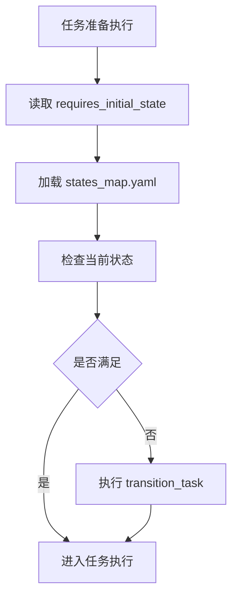

---
# 状态管理与状态规划

Aura 提供两类状态能力：
- **状态存储**：跨任务的持久化数据（StateStore）
- **状态规划**：执行任务前，确保系统处于指定状态

## 1. 状态存储（StateStore）
在 `config.yaml` 中配置：
```yaml
state_store:
  type: file
  path: ./project_state.json
```

状态存储流程图：

```mermaid
flowchart LR
  A[Task Action] --> B[state.set / state.get]
  B --> C[StateStoreService]
  C --> D[持久化介质]
```

该配置会将状态写入本地文件，适合单机调试或小型项目。若为数据库型存储可在此处切换类型与参数。

使用内置 Action（需确保 `state_actions.py` 被加载）：
```yaml
steps:
  set_value:
    action: state.set
    params:
      key: "user_name"
      value: "Aura"
  read_value:
    action: state.get
    params:
      key: "user_name"
```

## 2. 状态规划（StatePlanner）
- 在 Plan 根目录添加 `states_map.yaml`
- 在任务 `meta` 中指定 `requires_initial_state`

状态规划流程图：

```mermaid
flowchart TD
  A[任务准备执行] --> B[读取 requires_initial_state]
  B --> C[加载 states_map.yaml]
  C --> D[检查当前状态]
  D --> E{是否满足}
  E -- 否 --> F[执行 transition_task]
  E -- 是 --> G[进入任务执行]
  F --> G
```

状态规划适合“先检查状态再执行”的任务，例如设备需要处于可用状态才允许操作。

### states_map.yaml 示例
```yaml
states:
  ready:
    check_task: "state/check_ready"
    priority: 10
    can_async: true
  busy:
    check_task: "state/check_busy"

transitions:
  - from: ready
    to: busy
    cost: 1
    transition_task: "state/to_busy"
```

### 任务中启用
```yaml
my_task:
  meta:
    requires_initial_state: "ready"
  steps:
    ...
```

StatePlanner 会在任务执行前运行检查与转移任务。

### 2.1 典型使用场景
- 设备必须进入 `ready` 状态后才能执行任务。
- 业务需要在 `busy` 状态下跳过某些操作或触发清理任务。
