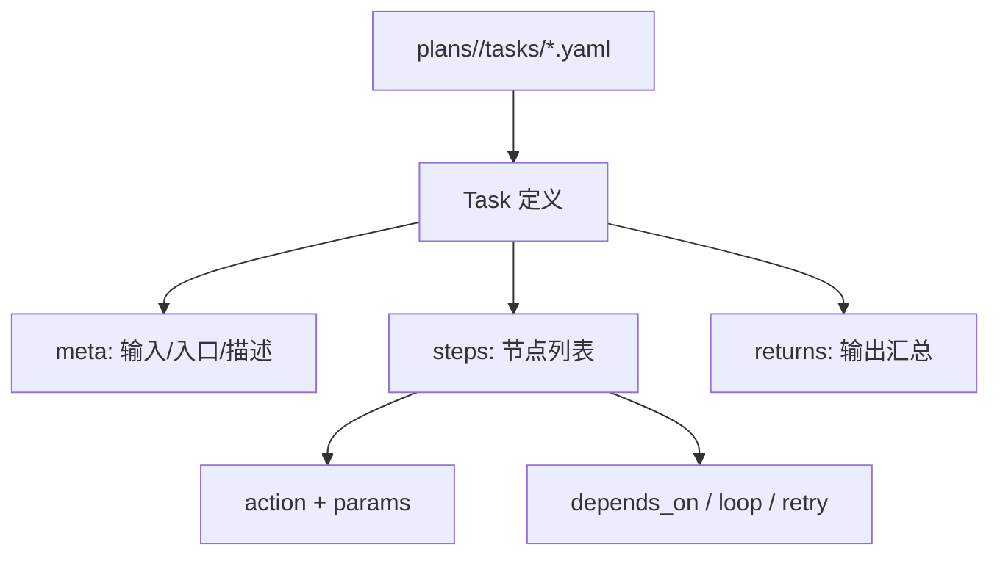

---
# 任务编写结构

本章讲清楚 Task 的文件组织、命名规则与核心字段，并给出可直接使用的模板。

## 任务结构示意图


## 1. 任务文件组织
- 任务位于 `plans/<plan>/tasks/` 下
- 单文件多任务：一个 `.yaml` 内可以定义多个任务

示例：
该示例在一个文件内声明了两个任务，适合将同一业务域的任务集中管理。
```yaml
# plans/HelloWorld/tasks/greeting.yaml
say_hello:
  steps:
    greet:
      action: log
      params:
        message: "Hello"

say_bye:
  steps:
    bye:
      action: log
      params:
        message: "Bye"
```

对应任务名：
- `greeting/say_hello`
- `greeting/say_bye`

常见命名建议：
- 文件名用小写和下划线，任务 key 用动词短语。
- 如果有子目录，任务名会包含目录前缀，例如 `auth/login`.

## 2. 任务最小结构
最小结构只需要 `steps` 和一个可执行节点，适合快速验证环境。
```yaml
simple_task:
  steps:
    step_1:
      action: log
      params:
        message: "Hello"
```

## 3. `meta` 字段
`meta` 用于描述任务入口、输入参数与状态要求，直接影响调度器校验和 UI 表现。
```yaml
meta:
  title: "Say Hello"
  description: "A simple demo"
  entry_point: true
  inputs:
    - name: "name"
      label: "User Name"
      type: "string"
      default: "Aura"
  requires_initial_state: "ready"
```

说明：
- `inputs` 必须是 list；调度器会校验缺失/多余输入
- `requires_initial_state` 将触发状态规划（见状态管理章节）

## 4. `steps` 字段
- `steps` 是一个 dict，每个 key 是节点 ID
- 节点最少包含 `action`

该示例展示了最常见的 “action + params” 组合，并使用输入变量构造请求。
```yaml
steps:
  fetch:
    name: "Fetch data"
    action: http.get
    params:
      url: "{{ inputs.url }}"
```

### 4.1 节点执行流程示意


## 5. `outputs` 与 `returns`
- `outputs` 用于为单个节点声明结构化输出
- `returns` 用于定义任务最终 `user_data`

示例中先把节点结果拆成结构化字段，再在 `returns` 中做最终输出映射。
```yaml
steps:
  fetch:
    action: http.get
    params:
      url: "{{ inputs.url }}"
    outputs:
      status: "{{ result.status_code }}"
      body: "{{ result.text }}"

returns:
  status: "{{ nodes.fetch.status }}"
```

注意：当定义 `outputs` 时，不会自动写入 `output` 字段。

## 6. 其他常用字段
- `execution_mode`: `sync` / `async`（任务级别）
- `triggers`: 事件触发器（见条件执行章节）
- `activates_interrupts`: 任务运行时激活中断规则

## 6.1 常见模板示例
```yaml
meta:
  title: "Download and Summarize"
  entry_point: true
  inputs:
    - name: "url"
      type: "string"
steps:
  fetch:
    action: http.get
    params:
      url: "{{ inputs.url }}"
  summarize:
    action: llm.summarize
    params:
      text: "{{ nodes.fetch.output }}"
    depends_on: fetch
returns:
  summary: "{{ nodes.summarize.output }}"
```

## 7. 下一章
- 循环结构：`readme/quick_start/loop_structure.md`
- 条件执行：`readme/quick_start/condition_execution.md`
- 上下文与模板：`readme/quick_start/context_and_rendering.md`
