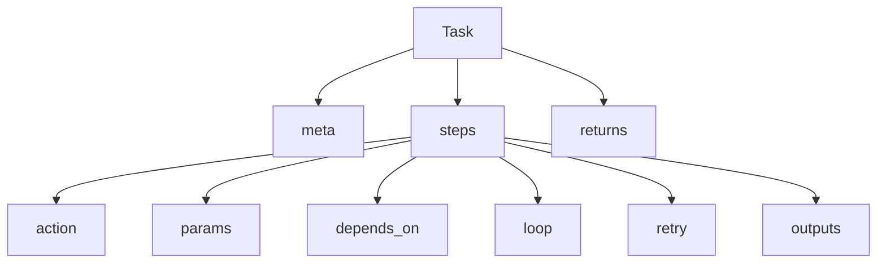

---
# 任务语法参考

本章是 Task 的字段参考，便于查阅完整结构。

## Task 字段关系图


## Task 顶层字段
- `meta`: 任务元数据
- `execution_mode`: `sync` / `async`
- `triggers`: 事件触发器列表
- `activates_interrupts`: 运行时激活的中断规则
- `returns`: 任务最终返回值模板
- `steps`: 任务节点定义

## meta
用于描述任务入口与输入参数，会影响调度校验与 UI 表现。
```yaml
meta:
  title: "Title"
  description: "..."
  entry_point: true
  inputs:
    - name: "param"
      label: "Param"
      type: "string"
      default: "x"
  requires_initial_state: "ready"
```

## triggers
用于配置事件触发式任务（如设备事件或系统事件）。
```yaml
triggers:
  - event: "device.*"
    channel: "Aura-Project/base"
```

- `event` 使用通配符匹配
- `channel` 可选，默认是插件 canonical id

## steps
节点是任务执行的最小单元，可配置依赖、循环与重试。
```yaml
steps:
  step_id:
    name: "Readable Name"
    action: log
    params:
      message: "Hello"
    depends_on: step_a
    loop:
      for_each: "{{ inputs.items }}"
      parallelism: 2
    retry: 3
    retry_delay: 1
    retry_on: ["TimeoutError"]
    retry_condition: "{{ result.status_code >= 500 }}"
    outputs:
      status: "{{ result.status_code }}"
```

### depends_on
- 字符串：依赖节点成功
- 列表：全部为真
- 字典：`and` / `or` / `not`
- `when:` 表达式

### loop
用于在一个节点内重复执行，同一 Action 会被多次调用。
- `for_each`: list/dict
- `times`: int
- `while`: 表达式
- `parallelism`: 并发数
- `max_iterations`: while 最大循环（默认 1000）

### retry
失败重试与条件重试可以同时使用，优先确保任务稳定性。
- `retry`: 次数
- `retry_delay`: 秒
- `retry_on`: 异常列表（类名或完整限定名）
- `retry_condition`: 成功后基于结果再判断是否重试
### timeout
- `timeout` / `timeout_sec`: ?????????????????? `execution.default_node_timeout_sec`


### outputs
- 定义命名输出字段
- 未定义时默认写入 `output`

## 完整示例
这个例子展示了请求 -> 解析 -> 通知的完整链路。
```yaml
demo_task:
  meta:
    title: "Fetch and Notify"
    entry_point: true
    inputs:
      - name: "url"
        type: "string"
  steps:
    fetch:
      action: http.get
      params:
        url: "{{ inputs.url }}"
      outputs:
        status: "{{ result.status_code }}"
        body: "{{ result.text }}"
    notify:
      action: log
      params:
        message: "Fetch status={{ nodes.fetch.status }}"
      depends_on: fetch
  returns:
    ok: "{{ nodes.fetch.status == 200 }}"
```

## 参考章节
- 任务结构：`readme/quick_start/task_about.md`
- 循环结构：`readme/quick_start/loop_structure.md`
- 条件执行：`readme/quick_start/condition_execution.md`
- 上下文与模板：`readme/quick_start/context_and_rendering.md`
